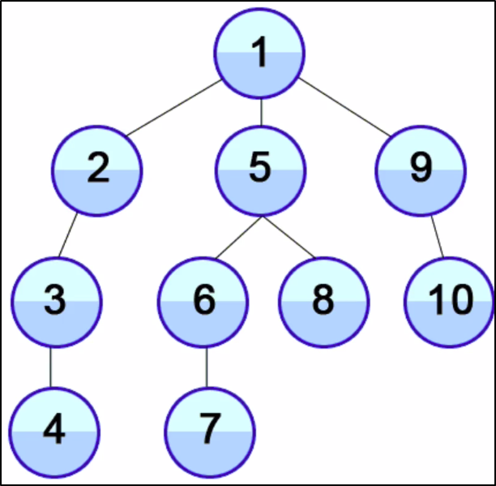

## DFS:
- Lower memory than BFS O(height_of_tree)
- Follows one branch through all levels
- Goes to nearest ancestor with unexplored child

```bash
     9
  4	20
1  6  15  170
```
### Orders:
- InOrder - [1, 4, 6, 9, 15, 20, 170]
- PreOrder - [9, 4, 1, 6, 20, 15, 170] 
	- Good for recreating a tree
- PostOrder - [1, 6, 4, 15, 170, 20, 9]

