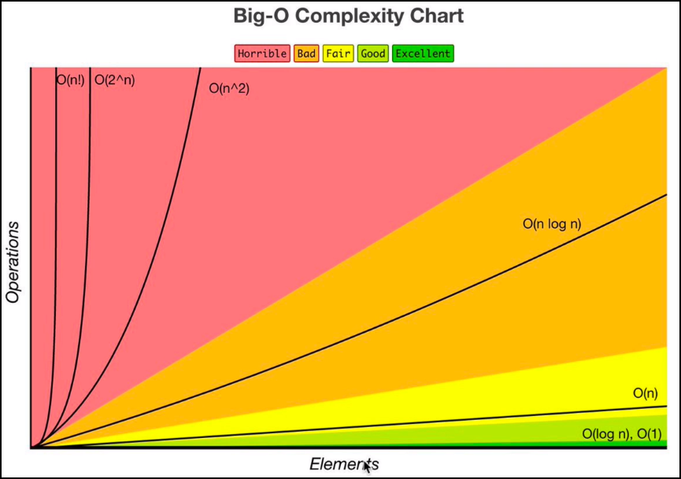

 
 

## Rules:

1. **Worst case**
	- maximum \# of function runs possible
2. **Remove constants**
	- O(n/2 + 101) → O(n)
	- O(2n) → O(n)
3. **Different terms for inputs** 
	- 2 for loops in function. one for input a, one for input b
	- O(a + b)
	- \+ for steps in order
	- \* for nested steps
4. **Drop non dominants**
	- O(n + n2) → O(n2)
