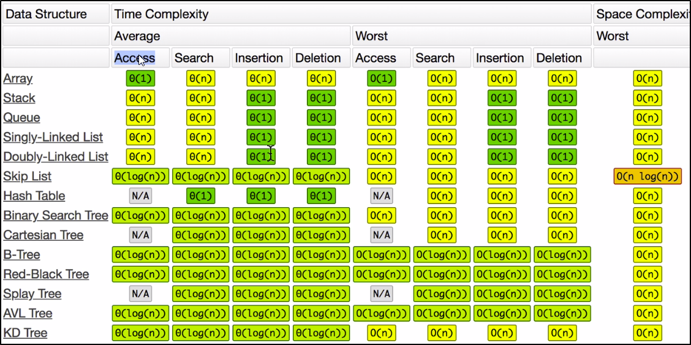

##  Data Structures:

    <ul style="flex: 1; padding-right: 10px;">
        <li>Arrays</li>
        <li>Stacks</li>
        <li>Queues</li>
        <li>Linked Lists</li>
    </ul>
    <ul style="flex: 1;">
        <li>Trees</li>
        <li>Tries</li>
        <li>Graphs</li>
        <li>Hash Tables</li>
    </ul>

 

## Operations on Data Structures:

    <ul style="flex: 1; padding-right: 10px;">
        <li>Insertion</li>
        <li>Deletion</li>
        <li>Traversal</li>
    </ul>
    <ul style="flex: 1;">
        <li>Searching</li>
        <li>Sorting</li>
		<li>Access</li>
    </ul>

 

<h2 align='center'>Common Operations</h2>

