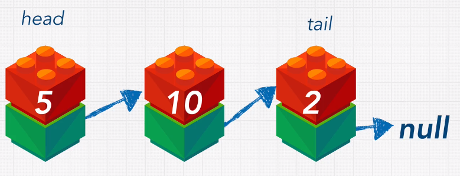

## Linked Lists:

 

 

| Operation    | Time Complexity | Example (Python)           |
| ------------ | --------------- | -------------------------- |
|prepend	     | O(1)            |      										     |
|append			    | O(1)            |  													   |
|lookup        | O(n)            | 															 |
|insert					| O(n)							|    												   |
|delete	     	 | O(n)            | 															|

 

## Single vs Double:
- Double can iterate in reverse
- Single uses less memory
- Double has O(1) pop