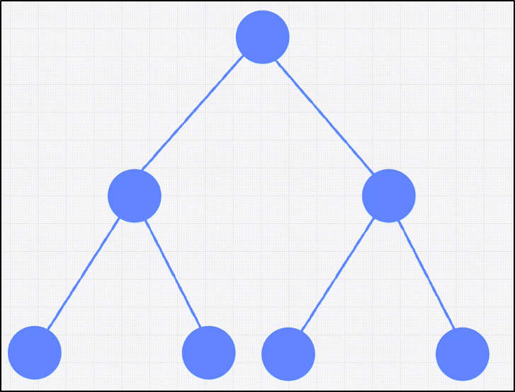

## Binary Tree
- Each node can have 0, 1, or 2 child nodes
- Each child can only have 1 parent

 

| Operation    | Time Complexity | Example (Python)           |
| ------------ | --------------- | -------------------------- |
|lookup        | O(log n)        | 		         |
|insert   	    | O(log n)        |				   |
|delete        | O(log n)        | 	 	 |

 

### Terminology:
- **Perfect Binary Tree**
	- all nodes have 0 or 2 children
	- bottom layer completely filled
- **Full Binary Tree**
	- all nodes have either 0 or 2 children
	- never 1 child
 

### Perfect Binary Tree
- \# nodes in level = 2# of level (levels start at 0)
- \# total nodes = 2height - 1
- log nodes = height

 

<div