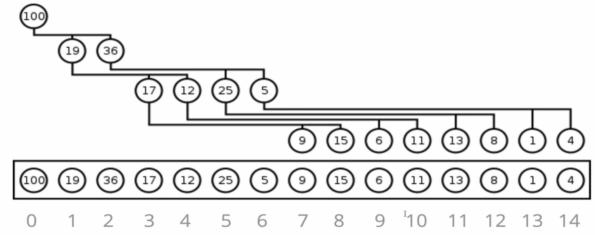

## Heap:
- <b>MaxBinaryHeap</b> - parent node larger than child nodes
- <b>MinBinaryHeap</b> - parent node smaller than child nodes
- Used with priority queues and graph traversal algos
 

| Operation    | Time Complexity | 
| ------------ | --------------- |
|insertion     | O(log n)        | 	
|removal   	    | O(log n)        |			
|search       | O(n)        |

 

### Represent as array:
- Children of node: 2n+1, 2n+2
- Find parent: `Math.floor((n-1)/2)`
