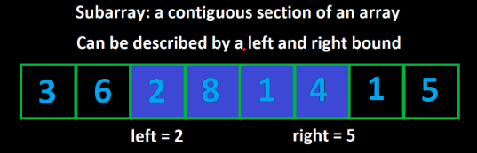
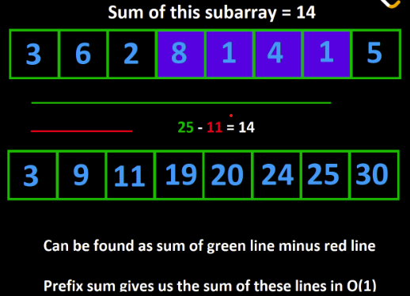

# Arrays & Strings

## Two Pointers
#### Method 1: Start the pointers at the edges of the input. Move them towards each other until they meet

<div style="background-color:rgb(219, 216, 216); border-left: 4px solid #ccc; padding: 10px; color: black">
<b>Example: Given a string s, return true if it is a palindrome, false otherwise.</b>

A string is a palindrome if it reads the same forward as backward. That means, after reversing it, it is still the same string. For example: "abcdcba", or "racecar".
</div>

```python
def check_if_palindrome(s):
    left = 0
    right = len(s) - 1

    while left < right:
        if s[left] != s[right]:
            return False
        left += 1
        right -= 1
    
    return True
```
- Time complexity: O(n) 
- Space complexity: O(1)

#### Method 2: Move along both inputs simultaneously until all elements have been checked.
<div style="background-color:rgb(219, 216, 216); border-left: 4px solid #ccc; padding: 10px; color: black">
<b>Example: Given two sorted integer arrays arr1 and arr2, return a new array that combines both of them and is also sorted. </b>
</div>

```python
def combine(arr1, arr2):
    # ans is the answer
    ans = []
    i = j = 0
    while i < len(arr1) and j < len(arr2):
        if arr1[i] < arr2[j]:
            ans.append(arr1[i])
            i += 1
        else:
            ans.append(arr2[j])
            j += 1
    
    while i < len(arr1):
        ans.append(arr1[i])
        i += 1
    
    while j < len(arr2):
        ans.append(arr2[j])
        j += 1
    
    return ans
```

## Sliding Window


#### When to use:
- Criteria that makes a subarray valid
- Need to find valid subarrays

```python
function fn(nums, k):
    left = 0
    curr = 0
    answer = 0
    for (int right = 0; right < nums.length; right++):
        curr += nums[right]
        while (curr > k):
            curr -= nums[left]
            left++

        answer = max(answer, right - left + 1)

    return answer
```

#### Number of subarrays
<div style="background-color:rgb(219, 216, 216); border-left: 4px solid #ccc; padding: 10px; color: black">
<b>Example: Given an array of positive integers nums and an integer k, return the number of subarrays where the product of all the elements in the subarray is strictly less than k.</b> 

<br>

For example, given the input nums = [10, 5, 2, 6], k = 100, the answer is 8. The subarrays with products less than k are:

[10], [5], [2], [6], [10, 5], [5, 2], [2, 6], [5, 2, 6]
</div>

```python
def numSubarrayProductLessThanK(self, nums: List[int], k: int) -> int:
    if k <= 1:
        return 0

    ans = left = 0
    curr = 1

    for right in range(len(nums)):
        curr *= nums[right]
        while curr >= k:
            curr //= nums[left]
            left += 1
            
        ans += right - left + 1

    return ans
```
- Time Complexity: O(n)
- Space Complexity: O(1)

#### Fixed Window Size
<div style="background-color:rgb(219, 216, 216); border-left: 4px solid #ccc; padding: 10px; color: black">
<b>Example 4: Given an integer array nums and an integer k, find the sum of the subarray with the largest sum whose length is k.</b>
</div>

```python
def find_best_subarray(nums, k):
    curr = 0
    for i in range(k):
        curr += nums[i]
    
    ans = curr
    for i in range(k, len(nums)):
        curr += nums[i] - nums[i - k]
        ans = max(ans, curr)
    
    return ans
```

## Prefix Sum
>A prefix sum represents the sum of all prefixes.


```python
prefix = [nums[0]]
for (int i = 1; i < nums.length; i++)
    prefix.append(nums[i] + prefix[prefix.length - 1])
```

<div style="background-color:rgb(219, 216, 216); border-left: 4px solid #ccc; padding: 10px; color: black">
<b>Example: Given an integer array nums, an array queries where queries[i] = [x, y] and an integer limit, return a boolean array that represents the answer to each query. A query is true if the sum of the subarray from x to y is less than limit, or false otherwise.</b>
</div>

```python
def answer_queries(nums, queries, limit):
    prefix = [nums[0]]
    for i in range(1, len(nums)):
        prefix.append(nums[i] + prefix[-1])
    
    ans = []
    for x, y in queries:
        curr = prefix[y] - prefix[x] + nums[x]
        ans.append(curr < limit)

    return ans
```

## String Builder
```python
def build_string(s):
    arr = []
    for c in s:
        arr.append(c)

    return "".join(arr)
```